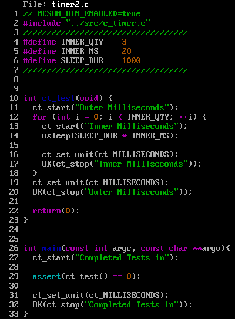

# c_timer


## A tool to time c code

### Prerequisites

This project is built using `meson` and `ninja`.

### Build

1. Configure the build directory with the command
   ```
   $ meson build
   ```

2. Compile with
   ```
   $ ninja -C build
   ```

3. Test
   $ meson test -C build --verbose

4. Usage

   

4. Invocation

   
